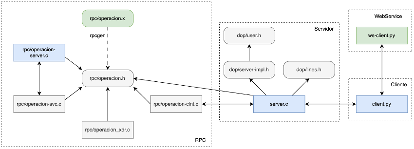

# Sistema peer-to-peer
*Autora: Celia Patricio Ferrer.*
*Fecha: 12 / 05 / 2024*

Este documento recoge todas las decisiones que se han llevado a cabo, así como las funcionalidades que se han desarrollado para cubrir todos los aspectos de este sistema de ficheros.

## Indice

- [Objetivo](#1-objetivo)
- [Arquitectura](#2-arquitectura)
- [Compilación y ejecución](#3-compilación-y-ejecución)
- [Operaciones](#4-operaciones)
    - [Registro de un usuario](#41-registro-de-un-usuario)
    - [Baja de un usuario](#42-baja-de-un-usuario)
    - [Conexión de un usuario](#43-conexión-de-un-cliente)
    - [Publicación de un fichero](#44--publicación-de-un-fichero)
    - [Eliminación de un fichero](#45-eliminación-de-un-fichero)
    - [Listado de usuarios](#46-listado-de-usuarios-conectados)
    - [Listado de publicaciones](#47-listado-de-publicaciones-de-un-usuario)
    - [Desconexión de un usuario](#48-desconexión-de-un-usuario)
    - [Transferencia de un fichero](#49-transferencia-de-un-fichero)
    - [Cierre el servicio](#410-cierre-del-servicio)
- [Implementación](#5-implementación)
    - [Cliente](#51-implementación-del-cliente)
    - [Servicio Web](#52-implementación-del-servicio-web)
    - [Servidor](#53-implementación-del-servidor)
    - [RPC](#54-implementación-del-sistema-rpc)
- [Pruebas realizadas](#6-pruebas-realizadas)
    - [Secuencia](#61-servicio-secuencial)
    - [Concurrente](#62-servicio-concurrente)

---
---

## 1. Objetivo

Esta práctica tiene como objetivo global desarrollar un sistema *peer-to-peer* de distribución de fichero entre clientes. 

En la primera parte del proyecto, se incluye la comunicación de procesos usando sockets TCP. Para ellos, se desarrolla una aplicación de distribuicón de ficheros entre clientes.

Mientras que, la segunda parte se centra en los principales conceptos relacionados con las llamadas a procedimientos remotos y los servicios web.

---
---

## 2. Arquitectura
La arquitectura que se ha diseñado para este sistema es modular y escalable con el fin de facilitar la anexión de las dos partes solicitadas. Se basa en un modelo descentralizado peer–to–peer, que permite la interacción entre clientes directamente sin la necesidad de depender de un servidor centralizado para el intercambio de ficheros. Además de las dos partes adicionales anexadas a este sistema para satisfacer la segunda parte.



De esta forma, el cliente solicita diferentes operaciones al servidor y además, permite la recepción de solicitudes de archivos directamente de otros clientes. Mientras que el servidor, recibe las peticiones y gestiona la base de datos, en donde se guarda la información relevante de los clientes. Por un lado, el servidor recibe las peticiones y devuelve la respuesta correspondiente, con el valor de salida tras realizar la operación pedida. Y por otro lado, el cliente envía la operación y lee la respuesta recibida. 

La integración del servicio web en la parte del cliente se utiliza para la obtenición de la fecha y la hora actual. Este servicio web devuelve una cadena con la fecha y la hora actual y es llamado por el cliente cada vez que desea enviar una petición, para enviar la petición junto a la fecha y a la hora realizada. Cuando el servidor principal recibe la fecha y la hora actual, actuará como cliente con el servidor RPC. Para ello, envía la petición de imprimir la operación por pantalla y envía el nombre del usuario, la operación solicitada y la cadena de caracteres con la fecha y la hora. 

---
---

## 3. Compilación y ejecución

Hay dos posibilidades para compilar y ejecutar este servicio. La primera se trata de una predefinida en la que se han preparado dos scripts que realizan la compilación y la apertura de las terminales necesarias. Además, de escribir los comandos necesarios para la ejecución global del servicio.

En primer lugar, en una terminal en donde esté abierto el proyecto, se debe dar los permisos necesaios con el comando:

```sh
chmod +x run_server.sh run_client.sh
```

Posteriormente, en esta terminal, se debe escribir el siguiente comando, para ejecutar la parte del servidor: 

```sh
run_server.sh
```

Y luego este otro comando, para ejecutar la parte del cliente: 

```sh
run_client.sh
```

El primer script se encarga de la parte del servidor (server.c y RPC server) que realiza la compilación necesaria con el comando *make* y abre dos terminales *gnome* en donde se ejecutan el servidor y el servidor de RPC, se da por defecto el valor del puerto 8080. Mientras que, el otro script se encarga de la parte del cliente (client.py y ws-client.py) que abre también dos terminales gnome y ejecuta el cliente y el WebService, se da por defecto los valores localhost y 8080 para el servidor y el puerto, respectivamente.

---

Por otro lado, esta segunda posibilidad es para realizar este proceso de forma manual. Para ello, se debe abrir cuatro terminales para cada componente del servicio. En una de ellas se debe realizar la compilación de la parte del servidor con el comando *make*. Una va a ser para el servidor RPC que se debe ejecutar con el comando siguiente:

```sh
./server_rpc
````

Otra terminal va a ser para el servidor del sistema que se debe ejecutar con el comando:

```sh
./server
````

Otra, para el WebService del cliente, que se debe ejecutar con el comando:

```sh
python3 ws-client.py
```

Y la última es para el cliente de Python, que se debe ejecutar con el comando siguiente:

```sh
python3 client.py -s <server_ip> -p <server_port>
```

Donde *server_ip* y *server_port* son la dirección IP y el puerto que se desee.

---
---

## 4. Operaciones

En esta sección se detallan las funcionalidades que tiene este servicio, así como de su funcionamiento. 

El cliente se trata de un intérprete de comandos multihilo que almacena información relevante como la dirección IP, el puerto, el nombre del usuario conectado, entre otros. El programa detecta errores en la línea de comandos y ejecuta diferentes procedimientos para las diferentes operaciones introducidas.

A continuación se describen las distintas operaciones que el cliente puede realizar en este servicio.

### 4.1. Registro de un usuario.

Cuando un cliente quiere registrarse en el servicio, se debe introducir el comando: 

```sh 
REGISTER <username>
```

Donde *username* es el nombre que el usuario decida y el que utilizará para hacer uso de la aplicación. Al realizar esto, el sistema internamente verifica que el nombre sea válido, para ello debe tener una longitud menor a 256 caracteres. Internamente, el sistema verifica que ese nombre de usurio sea único en el sistema y muestra por pantalla el resultado.

### 4.2. Baja de un usuario.

Por el contrario, cuando un cliente quiere darse de baja del servicio, se debe introducir el comando: 

```sh 
UNREGISTER <username>
```

Donde *username* es el nombre que inicialmente ha utilizado previamente para el registro. Internamente, el sistema verifica que el usurio exista en el registro y muestra por pantalla el resultado.

### 4.3. Conexión de un cliente.

Si el cliente quiere conectarse al sistema, se debe introducir el siguiente comando:

```sh 
CONNECT <username>
```

Donde *username* es el nombre del usuario que ha sido utilizado para el registro. El sistema internamente verifica que el usuario previamente esté registrado y si ya hay un cliente conectado, debido a que solo es posible la conexión de un único cliente por terminal. 

En este momento, el cliente estará conectado al sistema y podrá ver el contenido de otros usuarios, la lista de usuarios conectados y descargarse ficheros de otros usuarios conectados.

### 4.4.  Publicación de un fichero.

Si un cliente quiere realizar una publicación de un archivo, debe introducir el comando: 

```sh
PUBLISH <filename> <description>
```

Donde *filename* es el nombre del archivo y *description* una breve descripción del fichero a publicar. Para la realización de esta operación, es necesario que el usuario previamente esté conectado al sistema. 

### 4.5. Eliminación de un fichero.

Por el contrario, si un usuario desea eliminar una publicación suya, debe introducir el comando: 

```sh
DELETE <filename>
```

Donde filename es el nombre del archivo a publicar. Internamente, el sistema verifica que dicho fichero exista en la base de datos como publicado por ese usuario.

### 4.6. Listado de usuarios conectados.

Cuando un cliente desee obtener la lista con todos los usuarios conectados al sistema, deberá introducir el comando: 

```sh
LIST_USERS
```

Para ello, el usuario debe estar registrado y conectado al sistema. Como requisito para la operación *GET_FILE*, se deberá listar a los usuarios conectados justo antes de obtener el fichero publicado de otro usuario.

### 4.7. Listado de publicaciones de un usuario.

Si un cliente quiere ver las publicaciones realizadas por otro usuario del servicio, debe introducir el comando: 

```sh
LIST_CONTENT <username>
```

Donde *username* es el nombre del usuario cuyas publicaciones se desean ver (al que se le llamará usuario remoto). Como se mencionó con anterioridad, esta operación requiere que el usuario que lo solicita, se encuentre conectado al sistema.

### 4.8. Desconexión de un usuario.

Cuando un cliente quiere desconectarse del servicio, debe introducir el comando: 

```sh
DISCONNECT <username>
```

Donde *username* es el nombre que ha utilizado para registrarse y conectarse al sistema. Un usuario que se desee deconectar del servicio, previamente debe estar registrado y conectado.

### 4.9. Transferencia de un fichero.

Cuando el usuario registrado y conectado al sistema quiera obtener el fichero de otro usuario registrado y conectado al sistema, debe introducir el siguiente comando:

```sh
GET_FILE <remote_username> <remote_filename> <local_filename>
```

Donde *remote_username* es el nombre del usuario cuya publicación se quiere obtener, *remote_filename* es el nombre del fichero remoto que se quiere obtener y *local_filename* es el nombre del fichero local en donde se va a copiar el contenido. 

Como ya se ha mencionado, es necesario que, anteriormente, se ejecute la operación de listar los usuarios conectados. Al realizar esta operación, se verifica internamente que el usuario exista y esté conectado, al igual que el usuario remoto. Además, se comprueba lo mismo con los archivos.

### 4.10. Cierre del servicio.

En caso de que el usuario quiera cerrar el servicio, debe introducir el comando:

```sh
QUIT
```

Al recibir este comando, el sistema internamente desconectará al usuario si este está conectado y cerrará el servicio.

---
---

## 5. Implementación

En esta siguiente sección se detallan los aspectos relevantes llevados a cabo en cada componente.

### 5.1. Implementación del cliente.

De forma general, el sistema internamente al leer una operación en el intérprete de comandos, crea un *socket TCP/IP*. Posteriormente, se conecta al servidor con la función *connect* e indicando la dirección IP y el puerto especificado por línea de comandos en la ejecución inicial. Envía los datos necesarios para la solicitud de la operación y espera a la respuesta correspondiente. Finalmente, cierra la conexión con el servidor. Cuando el cliente recibe la respuesta dada por el servidor, dependiendo de esta muestra el mensaje correspondiente.

1. Registro de un usuario.
    
    El sistema internamente verifica que el *username* sea válido (una longitud menor a 256 caracteres). A continuación, procede a conectarse al servidor para enviar la operación, que incluye el comando, la fecha y hora y el nombre de usuario, a través del socket al servidor. Después, dependiendo de la respuesta que recibe, imprime por pantalla un mensaje. Este mensaje puede ser si el registro se completó con éxito, si el nombre está en uso o no se pudo realizar el registro por cualquier problema.

2. Baja de un usuario.
    
    Con esta operación, el sistema internamente verifica que el *username* sea válido. A continuación, se conecta al servidor y envía la operación, que incluye el comando, la fecha y hora y el nombre de usuario, a través del socket. Una vez que recibe la respuesta, verifica cuál ha sido e imprime por pantalla un mensaje. Es decir, si la eliminación del registro del usuario se completó con éxito, si el usuario no está previamente registrado o si no se pudo realizar por cualquier otro problema.

3. Conexión de un cliente.
    
    Al realizar esta operación, como las anteriores, el sistema internamente verifica que el *username* sea válido. Además, verifica si ya hay un cliente conectado, ya que solo es posible la conexión de un único cliente por cada terminal. En cuyo caso, se muestra el mensaje de error por pantalla. 
    
    A diferencia de las otras operaciones, en esta función se crea un servidor de escucha en un hilo separado. Para ello, crea un socket TCP/IP, configurado para escuchar cualquier interfaz de la red y un puerto libre. A continuación, se crea un nuevo hilo de ejecución cuya función a ejecutar es connection_client, se configura para que se cierre automáticamente y se inicia el hilo.

    Posteriormente, procede a conectarse al servidor. Luego, envía la operación, que incluye el comando, la fecha y hora actuales, el nombre de usuario, la dirección IP y el puerto, a través del socket al servidor. Una vez que recibe la respuesta, verifica cuál ha sido. Dependiendo de esto, imprime por pantalla si la conexión del usuario se completó con éxito, si el nombre no está registrado, si ya está conectado previamente o si no se pudo realizar por cualquier otro problema.

    La función *connection_client* se realiza en un bucle *while*, mientras se cumple la condición si el atributo connection se encuentra en true. En cuyo caso, acepta las peticiones que le lleguen. Posteriormente, crea otro hilo para tratar dicha petición (*tratar_peticion*), pasando como argumentos el socket devuelto por el accept.
    
    La función *tratar_peticion* funciona de forma similar a la del servidor, copia el socket en una variable local, protegiendo este proceso con un mutex. Una vez se ha copiado el socket, se recibe la petición y se procesa. En caso de que la operación sea *GET_FILE*, se recibe el resto de la operación. Posteriormente, se verifica que el fichero exista y se realiza una copia del contenido del fichero indicado en el fichero destino deseado. Se envía de vuelta el resultado, dependiendo de si todo se ha realizado correctamente o si se ha producido cualquier otro error (no exista el fichero u otro).

4.  Publicación de un fichero.
    
    Al realizar esta operación, el sistema internamente verifica que el *filename* sea válido (una longitud menor a 256 caracteres). Luego, procede a conectarse al servidor y envía la operación, que incluye el comando, la fecha y hora y el nombre del usuario conectado, el nombre y la descripción del fichero, a través del socket al servidor. Una vez que recibe la respuesta, verifica cuál ha sido. Dependiendo de esto, imprime por pantalla si la publicación del fichero se realizó con éxito, si el usuario no existe o si no está conectado previamente, si el fichero ya está publicado o si se produjo cualquier otro problema.

5. Eliminación de un fichero.
    
    En esta operación, el sistema también verifica que el *filename* sea válido. Luego, procede a conectarse al servidor y envía la operación (el comando, la fecha y hora y el nombre del usuario conectado y el nombre del fichero a eliminar). Una vez que recibe la respuesta, verifica cuál ha sido. Imprime por pantalla si la eliminación del fichero se completó con éxito, si el usuario no está previamente registrado o conectado, si el fichero no está publicado o si se produjo otro error.

6. Listado de usuarios conectados.
    
    Al recibir esta operación, el sistema procede a conectarse al servidor para enviar la operación. Esta está formada por el comando, la fecha y hora y el nombre del usuario conectado. Una vez que recibe la respuesta, verifica cuál ha sido. Dependiendo de esto, imprime por pantalla si se produjo un problema, si el usuario que lo ha solicitado no existe o no está conectado o si se produjo o no otro problema. Si se consigue el éxito, se imprime la lista de usuarios conectados. Además, se actualiza el atributo con el diccionario de los usuarios que actualmente están conectados.

7. Listado de publicaciones de un usuario.
    
    Al realizar esto, el sistema internamente verifica que el nombre haya sido escrito correctamente. A continuación, procede a conectarse al servidor y envía la operación, que incluye el comando, la fecha y hora, el nombre del usuario conectado y el nombre de usuario remoto. Una vez que recibe la respuesta, verifica cuál ha sido e imprime por pantalla si el listado se completó con éxito, si el usuario no está registrado o no está conectado al siste, si usuario remoto no existe o si se produjo cualquier otro error. En caso de tener éxito, se muestra el listado con todas las publicaciones que tiene dicho usuario.

8. Desconexión de un usuario.
    
    Al realizar esta operación, el sistema verifica que el nombre se haya escrito correctamente. A continuación, procede a conectarse y envía la operación (el comando, la fecha y hora y el nombre de usuario), a través del socket al servidor. Una vez que recibe la respuesta, verifica cuál ha sido. Dependiendo de esto, imprime por pantalla si la desconexión se completó con éxito, si el usuario previamento no está registrado o conectado o si se produjo un problema.

9. Transferencia de un fichero.

    Un prerequisito de esta operación es hacer un *LIST_CONTENT*, debido a que como se pide que esta funcionalidad sea independiente del servidor. Para ello, se debe obtener con anterioridad los usuarios conectados al sistema sin necesidad de solicitarselo al servidor. Tras realizar esta operación, internamente el sistema realizará un diccionario con todos los usuarios conectados y sus direcciones correspondientes, para posteriormente acceder a ello con facilidad.

    Al realizar esta operación, el sistema internamente verifica que todos los campos sean válidos. Tras esto, el sistema se conecta a la dirección del cliente remoto. Depués, envía la operación (el comando, el nombre del usuario remoto, el nombre del fichero remoto y el nombre del fichero local), a través del socket al cliente remoto. Una vez que recibe la respuesta, verifica cuál ha sido. Dependiendo de esto, imprime por pantalla si la obtención se realizó con éxito, si el fichero no existe o si se produjo otro error.
    
    Cabe mencionar que este nuevo fichero obtenido, no se ha incluido en el listado de ficheros ya que no se considera una publicación. Además, que esta función debe ser independiente del servidor.

10. Otros métodos.

    Para la recepción de la respuesta, se ha implementado *readline*. Esta función recibe un socket, del cual se desea leer un mensaje. Realiza un bucle while mientras que lee caracteres distintos al de terminación “\0” y devuelve el mensaje leido.

    Para el servicio web, se ha implementado otra función que se llama *getdatetime*. La función *getdatetime()* se utiliza para obtener la fecha y hora actuales. Para hacer esto, se conecta a un servicio web, utilizando el protocolo SOAP. Una vez establecida la conexión, llama al método *get_datetime()* del servicio web, que devuelve la fecha y hora actuales. Si ocurre algún error durante este proceso, se captura la excepción y se imprime el mensaje de error correspondiente.

---

### 5.2. Implementación del servicio web.

Este componente implementa un servicio web que utiliza el protocolo SOAP para proporcionar la fecha y hora actuales. Representa al servidor, se define una clase *DateTimeService* que tiene un método *get_datetime*. Este método se define como un procedimiento remoto y devuelve la fecha y la hora actuales en formato de cadena. Con el objetivo principal de proporcionar la fecha y hora actuales cada vez que se le envía una solicitud al servidor C.

---

### 5.3. Implementación del servidor.

Este otro componente del sistema actúa como servidor del sistema distribuido. Se trata de un servidor concurrente que permite la recepción de varias peticiones, las trata y hace lo correspondiente y devuelve la respuesta. En primer lugar, se declaran las variables globales entre las que encontramos: el descriptor del socket principal y una variable de control, el mutex y las variables condicionales para sincronizar los hilos. Esta implementación hace uso de *server–impl.h*.

La función principal del sistema (*main*) verifica la línea de comandos y configura los atributos del hilo. Crea un socket con *SO_REUSEADDR* para reutilizar la dirección tras cerrarlo, configura la dirección IP y el puerto del servidor, y enlaza el socket a estos. Inicia la escucha para aceptar conexiones y muestra un mensaje de inicialización del servicio. Configura una señal para manejar la interrupción *SIGINT* y cerrar el servidor. Finalmente, inicia un bucle infinito para aceptar conexiones de clientes, creando un nuevo descriptor de socket y un nuevo hilo para cada conexión.

La función *cierre* se lleva a cabo al recibir la señal de "ctrl+c" y lleva a cabo el fin del servicio. Para ello, vacia la base de datos, destruye los mutex y las variables condición necesarias, cierra el descriptor del socket y cierra el programa con el valor de éxito 0.

La función *tratar_petición* se encarga de procesar cada petición recibida del cliente. En primer lugar, copia de forma atómica el descriptor del socket recibido en una variable local para su posterior procesamiento. Luego se lee la operación y se declaran todas las variables que van a ser utilizadas. Y dependiendo de la operación obtenida, se realiza un procedimiento diferente.

De forma general, todas las operaciones obtienen el resto de mensajes (entre ellos, el nombre del usuario, la fecha y hora y otros valores necesarios). Posteriormente, llama al procedimiento remoto para que se imprima la operación. Una vez realizado esto, se llama a la operación que se implementa en *server–impl.c*. Dependiendo del resultado que se obtiene, envía un mensaje con el resultado u otro. Finalmente, se cierra el socket local y se termina la ejecución del hilo.

A continuación se describe el componente del sistema que hace uso el servidor para realizar las diferentes operaciones. Es decir, la implementación que se encuentra en el archivo *server–impl.c* y hace uso de *user.h*.

1. Registrar un usuario.

    Esta primera función recibe como parámetros únicamente el nombre del usuario. En primer lugar, crea el usuario con la estructura user e inicializa los valores de cada atributo. Posteriormente, se comprueba si el usuario previamente está registrado en el sistema, si es así, se retorna el valor 1, si no, se realiza el registro.

    Para llevar a cabo el registro en la base de datos, en primer lugar, se abre el fichero *users.dat* que se encuentra en el directorio data. Posteriormente se escribe en bytes la estructura del usuario. Se cierra el fichero de la base de datos. Y se crea el directorio con el nombre del usuario como nombre del directorio.

2. Dar de baja un usuario.

    Al igual que la anterior, esta función recibe como parámetros únicamente el nombre del usuario. En primer lugar, comprueba si el usuario previamente está registrado en el sistema, si no es así, se retorna el valor 1, si no, se realiza la eliminación del usuario en la base de datos.

    Para llevar a cabo esto, se abre el fichero *users.dat*, en modo lectura en bytes, de la misma forma, también se abre otro temporal llamado *temp.dat*. Se procede a leer en usuario en usuario, escribiéndolos en la base de datos temporal menos el usuario deseado. Se cierran ambos ficheros, se elimina el original y se renombra al temporal para que sea el nuevo fichero con la base de datos. Finalmente, también se busca el directorio, cuyo nombre es el nombre del usuario a eliminar, y se elimina.

3. Conectar un usuario.

    Esta otra función recibe como parámetros el nombre del usuario, la dirección IP y el puerto. En primer lugar se intenta obtener el usuario de la base de datos. Para ello, se recorre toda la base de datos comprobando si el nombre coincide con el deseado. En caso de encontrarlo, devuelve dicha estructura, si no, devuelve un *NULL*. Una vez se obtiene el usuario, si el usuario no está registrado (se obtiene un *NULL*), se devuelve el valor 1. Además, también se comprueba que no esté ya conectado, que en cuyo caso, se devuelve el valor 2.

    Posteriormente se actualiza los valores correspondientes de este usuario en la base de datos. Para ello, se abre el fichero users.dat y el fichero temporal. Se leen del fichero original y se escriben en el temporal en usuario en usuario, hasta encontrar el usuario deseado. Una vez es encontrado, se modifican los valores con los valores pasados como parámetros y se cambia la variable de control *conectado* a 1. Finalmente, se cierran ambos ficheros, se elimina el original y se renombra al temporal para que sea el nuevo fichero con la base de datos.

4. Desconectar un usuario.

    Esta otra función recibe como parámetros únicamente el nombre del usuario. En primer lugar se intenta obtener el usuario de la base de datos. Para ello, se recorre toda la base de datos comprobando si el nombre coincide con el deseado. Una vez se obtiene el usuario, si el usuario no está registrado (se obtiene un *NULL*), se devuelve el valor 1. Además, también se comprueba que no esté desconectado y que su valor de control *conectado* sea igual a 1, que en cuyo caso, se devuelve el valor 2.

    Posteriormente, se procede a modificar dicho usuario como conectado. Para ello, se abre el fichero *users.dat* y el fichero temporal. Se leen del fichero original y se escriben en el temporal en usuario en usuario, hasta encontrar el usuario deseado. Una vez es encontrado, se modifican los valores, la variable de control *conectado* se cambia a 0, la dirección IP se cambia a vacío y el puerto a 0. Finalmente, se cierran ambos ficheros, se elimina el original y se renombra al temporal para que sea la base de datos.

5. Publicar un fichero.

    Esta otra función recibe como parámetros el nombre del usuario y el nombre y la descripción del fichero a publicar. Al igual que el anterior, se intenta obtener el usuario de la base de datos. Una vez se obtiene el usuario, si el usuario no está registrado, se devuelve el valor 1. Se comprueba también que esté conectado y que su valor de control conectado sea igual a 1, que en caso de que no sea así, se devuelve el valor 2. Y se comprueba si el archivo ya está publicado, se recorre el array de ficheros y verifica que el nombre coincida con otro que ya exista, en caso de ser así, se devuelve un 3.

    Posteriormente, se procede a realizar la publicación del archivo para ese usuario. Para ello, se abre el fichero *users.dat* y el fichero temporal. Se leen del fichero original y se escriben en el temporal en usuario en usuario, hasta encontrar el usuario deseado. Una vez es encontrado, se modifica el usuario, agregando en el array de ficheros el nuevo fichero junto a su descripción. Finalmente, se cierran ambos ficheros, se elimina el original y se renombra al temporal para que sea la base de datos. Además, se realiza la creación del fichero en el directorio cuyo nombre es el del nombre del usuario.

6. Eliminar un fichero publicado.

    Al igual que el anterior, esta función recibe como parámetros el nombre del usuario y el nombre y la descripción del fichero a publicar. En primer lugar, se intenta obtener el usuario de la base de datos. Una vez se obtiene el usuario, si el usuario no está registrado (se obtiene un *NULL*), se devuelve el valor 1. Se comprueba también que esté conectado y que su valor de control *conectado* sea igual a 1, que en caso de que no sea así, se devuelve el valor 2. Y se comprueba si el archivo está publicado previamente, se recorre el array de ficheros y verifica que el nombre coincida con uno que ya exista, en caso de no ser así, se devuelve un 3.

    A continuación, se procede a realizar la eliminación del archivo. Para ello, se abre el fichero *users.dat* y el fichero temporal. Se leen del fichero original y se escriben en el temporal en usuario en usuario, hasta encontrar el usuario deseado. Una vez encontrado, se elimina del array de ficheros del usuario, el fichero desado y su descripción. Finalmente, se cierran ambos ficheros, se elimina el original y se renombra al temporal para que sea la base de datos. Además, se realiza la eliminación del fichero en el directorio cuyo nombre es el del nombre del usuario.

7. Listar usuarios conectados.

    Esta otra función recibe como parámetros el nombre del usuario conectado que solicita la operación y el puntero a la cadena de caracteres, en donde se va a escribir la lista de los usuarios. Al igual que el anterior, se intenta obtener el usuario de la base de datos. Una vez se obtiene el usuario, si el usuario no está registrado (se obtiene un *NULL*), se devuelve el valor 1. Se comprueba que esté conectado y que su valor de control *conectado* sea igual a 1. Y en caso de que no sea así, se devuelve el valor 2.

    Posteriormente si no se produjo ningún error, se procede a realizar la obtención del listado de todos los usuarios conectados al sistema. En primer lugar, se obtiene el número de usuarios conectados. En segundo lugar, se obtiene el listado con los nombres, las direcciones ip y los puertos de los usuarios conectados. Para ello, se abre el fichero *users.dat*. Se leen todos los usuarios y si su variable de control *conectado* es igual a 1, se añaden a la cadena de caracteres con la lista de usuarios conectados. Finalmente se cierra el fichero y se retorna la lista.

8. Listar publicaciones de un usuario.

    Esta otra función recibe como parámetros el nombre del usuario conectado que solicita la operación, el nombre del usuario remoto y el puntero a la cadena de caracteres, en donde se va a escribir la lista de los ficheros. Al igual que el anterior, se intenta obtener el usuario de la base de datos. Una vez se obtiene el usuario, si el usuario no está registrado (se obtiene un *NULL*), se devuelve el valor -1. Se comprueba que esté previamente conectado y que su valor de control *conectado* sea igual a 1. Y en caso de que no sea así, se devuelve el valor -2.

    Posteriormente si no se produjo ningún error, se procede a realizar la obtención del listado. En primer lugar, se obtiene el usuario remoto, en caso de que no esté registrado, se retorna el valor -3. Si no, se lee todos los ficheros publicados y se concatenan en el puntero a la lista de ficheros. Finalmente se devuelve el valor del número de ficheros.

9. Otras funciones.

    En esta sección se describen otras funciones utilizadas para la gestión de la base de datos. La función *print_usuarios* se recorre toda la base de datos e imprime cada usuario junto a sus atributos. La función *iniciar_base_datos* esta función crea el fichero de la base de datos en modo binaro. Y la función *eliminar_base_datos* elimina el fichero de la base de datos, junto a los directorios de los usuarios que hayan sido creados. Estas dos últimas son de utilidad, ya que cada vez que se inicia nuevamente el servidor, se reinicia la base de datos.

10. RPC imprimir.

    Esta última función es la que realiza la llamada al procedimiento remoto actuando como cliente. Crea el cliente para el RPC y la estructura de la operación, dando los valores correspondientes que recibe como parámetros. Realiza la llamada al procedimiento remoto para que imprima la operación por pantalla, pasando la estructura como argumento. En caso de error, se muestra por pantalla. Finalmente, cierra el cliente y retorna el valor de 0 para indicar el éxito.

---

### 5.4. Implementación del sistema RPC.

Para llevar a cabo la utilización de RPC, en primer lugar, se tuvo que definir la interfaz de servicio (*operacion.x*), definir la única operación de imprimir la operación y la estructura para pasar los argumentos necesarios. Posteriormente, se utilizó un compilador para generar los archivos que se encargan de las comunicaciones y se usó el comando:

```sh
rpcgen -NMa tupla.x
```

Tras realizar esto, se generan los siguientes archivos:
- *operacion.h* encabezado con las definiciones incluidas en la definición de la interfaz. Este es el archivo compartido que se incluye tanto en el servidor como en el cliente (el servidor del sistema distribuido *peer–to–peer*).
- *operacion_xdr.c* contiene las rutinas de serialización y deserialización necesarias para convertir los datos en un formato que pueda ser transmitido a través de la red.
- *operacion_svc.c* incluye la implementación del servidor RPC, contiene la lógica para procesar las peticiones RPC entrantes.
- *operacion_clnt.c* incluye la implementación del cliente RPC (en este caso, claves), proporciona las funciones necesarias para realizar las llamadas a los procedimientos remotos al servidor.
- *operacion_server.c* incluye la implementación del servidor RPC para recibir las peticiones.

Cuando el servidor RPC recibe la petición de imprimir_operación, obtiene los valores correspondientes de la estructura pasada como parámetro. Comprueba si el valor del fichero es distinto a vacío. En cuyo caso se trata de una operación que no requiere poner dicho atributo, y en caso contrario, se añade. Finalmente, imprime el mensaje de esta manera: `<user_name> <operacion> <datetime>`

---

### 5.5. Implementación de *lines*.

Este código es correspondiente para el envío y la recepción de mensajes a través de sockets TCP. Contiene las funciones fundamentales *recvMessage* y *sendMessage* implementadas para recibir y enviar mensajes a través de la red de manera eficiente. Además, también se tratan los posibles errores que puedan dar al leer o al escribir dichos mensajes y se garantiza la integridad de la comunicación. Los mensajes se leen de carácter en carácter hasta encontrar el caracter de terminación “\0” y se escriben tal cual ya que se proporciona el tamaño del mensaje.

---
---

## 6. Pruebas realizadas

### 6.1. Servicio secuencial

En primer lugar, en esta parte se recogen las pruebas realizadas para la comprobación del funcionamiento secuencial del sistema. Se omiten las pruebas realizadas por el parser debido a que esto es porporcionado y no aporta funcionalidad en el sistema.

1. <u>Operaciones cliente-servidor que se deben realizar con éxito</u>, además de poder ver reflejado dichas operaciones en la base de datos.

    | Caso | Comandos utilizados | Respuesta obtenida |
    | ----------- | :----------- | :-----------: |
    | Registrar un usuario que no exista.  | `REGISTER USER` | Se recibe la respuesta OK. Se crea un directorio con nombre del usuario y se guarda en la base de datos. Se imprime en el servidor RPC la instrucción. |
    | Conectar a un usuario registrado. | `REGISTER USER` <br> `CONNECT USER` | Se recibe la respuesta OK. Se actualiza la base de datos. Se imprime en el servidor RPC la instrucción. |
    | Desconectar a un usuario registrado y conectado. | `REGISTER USER` <br> `CONNECT USER`  <br> `DISCONNECT USER` | Se recibe la respuesta OK. Se actualiza la base de datos. Se imprime en el servidor RPC la instrucción. |
    | Publicar un fichero con un usuario registrado y conectado. | `REGISTER USER` <br> `CONNECT USER`  <br> `PUBLISH file.txt Esta es la descripción del fichero.` | Se recibe la respuesta OK. Se crea un fichero con el nombre en el directorio del usuario conectado y se actualiza la base de datos. Se imprime en el servidor RPC la instrucción. |
    | Eliminar un fichero con un usuario registrado y conectado. | `REGISTER USER` <br> `CONNECT USER` <br> `PUBLISH file.txt Esta es la descripción del fichero.` <br> `DELETE file.txt` | Se recibe la respuesta OK. Se elimina el fichero con el nombre en el directorio del usuario conectado y se actualiza la base de datos. Se imprime en el servidor RPC la instrucción. |
    | Listar a los usuarios conectados con un usuario registrado y conectado. | `REGISTER USER` <br> `CONNECT USER`  <br> `LIST_USERS` | Se recibe la respuesta OK. Se muestra la lista de usuarios conectados y se actualiza el diccionario con los usuarios conectados. Se imprime en el servidor RPC la instrucción. |
    | Listar el contenido de un usuario que exista con un usuario registrado y conectado. | `REGISTER USER` <br> `REGISTER OTRO` <br> `CONNECT USER`  <br> `LIST_CONTENT OTRO` | Se recibe la respuesta OK. Se muestra la lista de los fichero publicados por ese usuario. Se imprime en el servidor RPC la instrucción. |

2. <u>Operaciones cliente-servidor que deben dar fallo</u> y no modificar la base de datos.

    | Caso | Comandos utilizados | Respuesta obtenida |
    | ----------- | :----------- | :-----------: |
    | Registrar un usuario que exista.  | `REGISTER USER` <br> `REGISTER USER` | Se recibe que el nombre de usuario ya está en uso. No me crea un nuevo directorio con este nombre y no se guarda en la base de datos nuevamente. Se imprime en el servidor RPC la instrucción. |
    | Conectar a un usuario no registrado. | `CONNECT USER` | Se recibe que el usuario no existe, no está registrado. No se actualiza la base de datos. Se imprime en el servidor RPC la instrucción. |
    | Conectar a un usuario que ya está conectado. Debe ser en terminales distintas. | `REGISTER USER` <br> `CONNECT USER` <br> <br> `CONNECT USER` | Se recibe que el usuario ya está conectado. No se actualiza la base de datos. Se imprime en el servidor RPC la instrucción. |
    | Conectar a dos usuarios distintos en una misma terminal. | `REGISTER USER` <br> `REGISTER OTRO` <br> `CONNECT USER`  <br> `CONNECT OTRO` | Se recibe un error ya que solo un usuario puede estar conectado a una terminal. No se actualiza la base de datos. No se imprime en el servidor RPC la instrucción. |
    | Desconectar a un usuario que no esté registrado. | `DISCONNECT USER` | Descripción. |
    | Desconectar a un usuario que no esté conectado. | `REGISTER USER` <br> `DISCONNECT USER` | Se recibe que el usuario no está conectado. No se actualiza la base de datos. Se imprime en el servidor RPC la instrucción. |
    | Publicar un fichero con un usuario no registrado. | `PUBLISH file.txt No se publica.` | Se recibe que el usuario no existe, no está registrado. No se actualiza la base de datos. Se imprime en el servidor RPC la instrucción. |
    | Publicar un fichero con un usuario no conectado. | `REGISTER USER` <br> `CONNECT USER` <br> `DISCONNECT USER` <br> `PUBLISH file.txt No se publica.` | Se recibe que el usuario no está conectado. No se actualiza la base de datos. Se imprime en el servidor RPC la instrucción. |
    | Publicar un fichero que ya ha sido publicado. | `REGISTER USER` <br> `CONNECT USER` <br> `PUBLISH file.txt Esto es una prueba.` <br> `PUBLISH file.txt Esto no se publica.` | Se recibe que el fichero ya ha sido publicado. No se modifica la base de datos. Se imprime en el servidor RPC la instrucción. |
    | Borrar un fichero con un usuario no registrado. | `DELETE file.txt` | Se recibe que el usuario no existe, no está registrado. No se actualiza la base de datos. Se imprime en el servidor RPC la instrucción. |
    | Borrar un fichero con un usuario no conectado. | `REGISTER USER` <br> `CONNECT USER` <br> `PUBLISH file.txt Descripción.` <br> `DISCONNECT USER` <br> `DELETE file.txt` | Se recibe que el usuario no está conectado. No se actualiza la base de datos. Se imprime en el servidor RPC la instrucción. |
    | Borrar un fichero que no existe. | `REGISTER USER` <br> `CONNECT USER` <br> `DELETE no-existe-file.txt` | Se recibe que el fichero no está publicado. No se actualiza la base de datos. Se imprime en el servidor RPC la instrucción. |
    | Listar a los usuarios conectados con un usuario no registrado. | `LIST_USERS` | Se recibe que el usuario no existe, no está registrado. No se muestra la lista ni se obtiene el diccionario. |
    | Listar a los usuarios conectados con un usuario no conectado. | `REGISTER USER` <br> `CONNECT USER` <br> `DISCONNECT USER` <br> `LIST_USERS` | Se recibe que el usuario no está conectado. No se muestra la lista ni se obtiene el diccionario. |
    | Listar el contenido de un usuario con un usuario no registrado. | `LIST_CONTENT USER` | Se recibe que el usuario no existe, no está registrado. No se muestra la lista del contenido del usuario remoto. |
    | Listar el contenido de un usuario con un usuario no conectado. | `REGISTER USER` <br> `CONNECT USER` <br> `DISCONNECT USER` <br> `LIST_CONTENT USER` | Se recibe que el usuario no está conectado. No se muestra la lista del contenido del usuario remoto. |
    | Listar el contenido de un usuario que no está registrado. | `REGISTER USER` <br> `CONNECT USER` <br> `LIST_CONTENT NO` | Se recibe que el usuario remoto no está registrado. No se muestra la lista del contenido del usuario remoto. |

3. <u>Operaciones cliente-cliente.</u>

    | Caso | Comandos utilizados | Respuesta obtenida |
    | ----------- | :----------- | :-----------: |
    | Obtener un fichero de un usuario remoto que esté registrado y conectado, con un usuario registrado y conectado. Se necesita dos terminales. Para esta prueba, se ha escrito el contenido de file.txt en el generado por PUBLISH.  | `REGISTER USER` <br> `CONNECT USER` <br> `PUBLISH file.txt Este es el archivo.` <br> <br> `REGISTER OTRO` <br> `CONNECT OTRO` <br> `LIST_USERS` <br> `GET_FILE USER file.txt here.txt` | Se recibe la respuesta OK. Se añade al usuario que solicita el fichero, el nuevo fichero con el contenido. En el servidor, no le llega nada de la operación GET_FILE. |
    | Obtener un fichero de un usuario remoto que no está en el sistema.  | `REGISTER USER` <br> `CONNECT USER` <br> `GET_FILE NO no-existe.txt here.txt` | Se recibe un error debido a que no fue posible conectarse con un usuario que no está en el sistema. |
    | Obtener un fichero de un usuario remoto que no existe.  | `REGISTER USER` <br> `CONNECT USER` <br> `GET_FILE OTRO no-existe.txt here.txt` | Se obtiene que el fichero no existe. |

### 6.2. Servicio concurrente

Para validar la capacidad de funcionamiento concurrente del sistema, se realizaron pruebas integrales que implicaban dos operaciones simultáneas en dos sistemas operativos diferentes. Específicamente, se probó el escenario en el que dos clientes solicitan diferentes operaciones al mismo tiempo, cada uno operando en una máquina distinta.

Para esta prueba, se configuró el servidor en un sistema operativo Ubuntu, mientras que el cliente se ejecutaba en MacOS. Esta configuración permitió evaluar el funcionamiento del sistema entre diferentes sistemas operativos. Los resultados de las pruebas fueron positivos, demostrando que el sistema puede manejar eficientemente múltiples solicitudes concurrentes sin errores.

Además de probar todas las funcionalidades con el servidor, se realizó una prueba adicional para evaluar la capacidad del sistema para manejar el intercambio de archivos entre dos clientes, uno en Ubuntu y otro en MacOS. Esta prueba fue un éxito, lo que demuestra que el sistema puede facilitar el intercambio de archivos entre diferentes sistemas operativos de manera eficiente.

---
---
